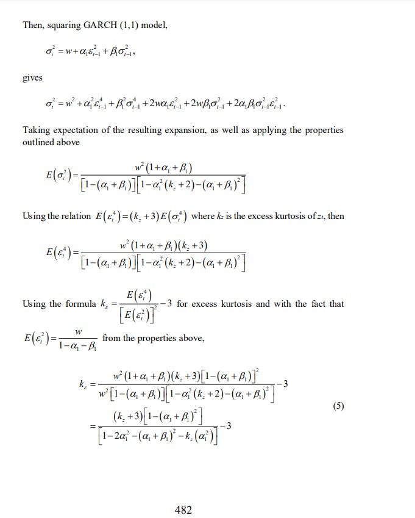
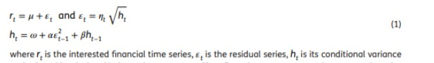
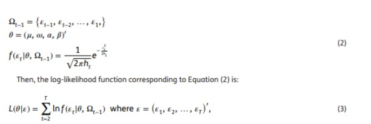
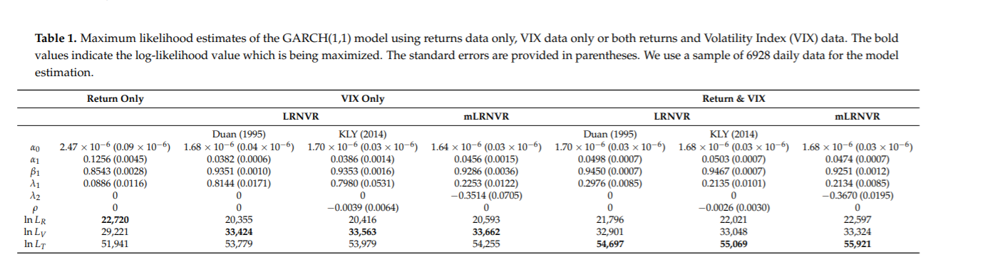

```{r setup, include=FALSE}
knitr::opts_chunk$set(echo = FALSE)
```


## Why do we want to forecast volatiltiy of the stock market?


- Risk management
- Portfolio Optimization
- To estimate the return volatility of stocks, bonds, and other investment assets
- Many other financial activities

- [What good is a Volatility model ? ](https://www.stern.nyu.edu/rengle/EnglePattonQF.pdf)

## Investigative Questions

- 1) How will a single variable time series improve our prior beliefs that stocks have 


- 2) What will be the forecasted returns of the SP500 stock on the subsequent day not in the model?

## Prerequisites ( What is SDE and why is it important? )

 


- A stochastic process $(S_t)_{t\geq0}$ is a GBM(Geometric Brownian Motion) if it is the following stochastic differential equation (SDE) of the form:

$$ dS_{t}=\mu S_{t}\,dt+\sigma S_{t}\,dW_{t} $$

- $(W_t)_{t\geq0}$ is a Standard Brownian Motion.

- Black-Scholes, an asset pricing model, follows this model. 
- [Non-trivial introduction to SDE in Finance ](https://www.springer.com/gp/book/9780387401010)

## Interpretation of GBM on Black-Scholes model
$$ dS_{t}=\mu S_{t}\,dt+\sigma S_{t}\,dW_{t} $$

- t = time of the year(in days) 

- $S_t$ = price of the underlying asset at time t 

- $S_0$ = price of the underlying asset at time t=0

- $\mu$ = drift rate (i.e. expected return) of the asset at time t

- $\sigma$ = volatility of the asset

## Problems with Black-Scholes

- Assumes stock prices to follow lognormal distribution at all times
- No considerations of dividend payout
- Assumes constant return rate $\mu$
- ***Assumes constant volatility***

## How do we fix constant volatility of Black Scholes? 

- GARCH (A time series model) introduced by Engle (1982) and Bollerslev 

$$y_t ∼ N (0, σ_t^2) $$
$$ σ_t^2 = α_0 + α_1y_{t−1}^2 + βσ_{t−1}^2 $$ 

- $\sigma_t$ =  Volatility at time t 

- $y_{t-1}$ = log of the return at time t-1. (i.e. ln(\frac{S_t}{S_0}))

- other models to consider: Student's t-distribution and General Error Distribution

## Parameters of GARCH

- Error parameter: α1 is a measurement of how the model reacts to volatility. Larger α1 value implies the more sensitive the model is to large drops/rises. 

- Lag parameter: β is a measurement of how long the volatility is going to be. For example, the larger β value implies it is going to take longer for the current volatility trend to die out. 

- Volatility Persistence parameter: α1+β is a measurement of how fast the current shock to volatility will die away, or the conditional volatility converges to the long-term average.

## Parameters of GARCH Part 2




## Libraries 


```{r,echo = TRUE,warning = FALSE,error=FALSE, message = FALSE}
library(rstan)
library(ggplot2)
library(plotly)
library(dplyr) 
library(broom)
library(quantmod)
library(matrixStats)
```
- rstan (R interface of stan library for Bayesian modeling)
- ggplot2 (R visualization library)
- plotly (Interactive visualiztion using ggplot2)
- quantmod (Library to download historical market data)
- broom (Convert objects to "Tidy tibbles")

## Data
- Using financial time series data
- Dataset includes SP500 daily return series that extends from 2020-01-01 to 2020-09-02
- Source of data: finance.yahoo.com


## Libraries(Cont)

```{r, echo = TRUE,warning = FALSE,error=FALSE, message = FALSE}
rstan_options(auto_write = TRUE)

options(mc.cores = parallel::detectCores())

#getSymbols("^GSPC",from = "2007-01-01",)
GSPC <- readRDS("GSPC.rds")

SP500              <- GSPC$GSPC.Adjusted
qqnorm(SP500)
qqline(SP500, col="blue")
hist(SP500)
#Use logarithmic formulas to calculated SP 500  return series 
SP500Ret           <- diff(log(SP500), lag = 1)
SP500Ret[is.na(SP500Ret)] <- 0
colnames(SP500Ret) <- c('LogReturn')
#Visualizing Cleaned Data
qqnorm(SP500Ret, main = "QQ Norm: SP500Ret Applied Logarithmic")
qqline(SP500Ret, col="blue")
hist(SP500Ret, main = "Histogram: SP500Ret Applied Logarithmic")
```

## Log-Return time series data of SP500(2007 to current)


```{r , echo = FALSE,,warning = FALSE,error=FALSE, message = FALSE}


## Viz of log return
tidySP500Ret <- tidy(SP500Ret)
plot<- ggplot(tidySP500Ret, aes(x = index, y = value, color = series)) + 
  geom_line() + 
  theme_bw() +
  labs(title = "SP500 Log Returns from 2007 to 2020", x = "")
plot
```

## Log-Return of SP500 in 2020

```{r, echo = FALSE,,warning = FALSE,error=FALSE, message = FALSE}
unwantedObs <- SP500Ret["2007-01-01/2019-12-31", which.i=TRUE]

# Remove all data up to 2019 December
SP500Ret2020 <- SP500Ret[-unwantedObs,]

# Remove data from Sept 3 to later since Market dropped again at Sept3

ggplot(tidy(SP500Ret2020), aes(x = index, y = value, color = series)) + 
  geom_line() + 
  theme_bw() +
  labs(title = "SP500 Log Returns from January to Sept 02,2020", x = "")


```


## Bayesian GARCH Model





## Distinguishing dataset
- estimate parameters of models using data from 2020-01-01 to 2020-09-02
- having the majority of the data to estimate parameters of models, we anticipate a rise in the MAE while making forecasts

```{r , echo =FALSE,warning = FALSE,error=FALSE, message = FALSE}

garchmodel <- "data {
  int<lower=0> T;  //total number of days
  int<lower=0> H; //number of days ahead forecast
  real y[T];  // log return at time T
  real<lower=0> sigma1; //3 sqrt volatiltiy
}
parameters {
  real mu; 
  real<lower=0> alpha0;          
  real<lower=0,upper=1> alpha1;  
  real<lower=0, upper=(1-alpha1)> beta1; 
}

transformed parameters {
  real<lower=0> sigma[T];
  sigma[1] = sigma1;
  for (t in 2:T)
    sigma[t] = sqrt(alpha0 +
                      + alpha1 * square(y[t - 1] - mu)
                    + beta1  * square(sigma[t - 1]));
}
model {
  // prior
  alpha0 ~ normal(2.47e-6,0.5);
  alpha1 ~ normal(0.1256,0.5);
  beta1 ~ normal(0.8543,0.5);
  // likelihood
  y ~ normal(mu,sigma);
}
generated quantities {
  real<lower=0> sigma_pred[T];
  real<lower=0> sigma_bfore[H];
  real y_bfore[H];
  real y_pred[T];

  for (h in 1:H) {
    sigma_bfore[h] = sqrt(
      alpha0
      + alpha1 * pow(y[T + h - 1], 2)
      + beta1 * pow(sigma[T + h - 1], 2)
      );
    y_bfore[h] = normal_rng(0, sigma_bfore[h]);
  }
  
  sigma_pred[1] = sigma1;
  y_pred[1] = normal_rng(0, sigma1);

  for (t in 2:T) {
    sigma_pred[t] = sqrt(
    alpha0
    + alpha1 * pow(y_pred[t-1], 2)
    + beta1 * pow(sigma_pred[t-1], 2)
    );
    y_pred[t] = normal_rng(0, sigma_pred[t]);
}
}"
```

## Bayesian GARCH Model Part 2


## Bayesian GARCH Model Part 3

 

## Where do these prior values come from?

- [GARCH Option Pricing Models and the Variance
Risk Premium ](https://www.mdpi.com/1911-8074/13/3/51/htm)

- From frequentist GARCH model
- Recorded until Janurary 2020 (Before March Crash)
- Lower parameters' values
- Our Bayesian GARCH model dates to Sept 02, 2020. (Including March Crash and Recovery )




```{r , echo =FALSE,warning = FALSE,error=FALSE, message = FALSE}
y <-  list(y = as.numeric(SP500Ret2020), T = length(SP500Ret2020),H=1, 
           sigma1 = sd(SP500Ret2020))
SP500_model <- stan(model_code = garchmodel, data = y,
                    chains = 4,
                    iter = 1250,
                    warmup = 250,
)


```

## Posterior Parameters' Traceplot 
```{r , echo =FALSE,warning = FALSE,error=FALSE, message = FALSE}

params <- rstan::extract(SP500_model)
bayesplot::mcmc_trace(SP500_model,pars = c("alpha0","alpha1","beta1"))


```


## Posterior Distributions

```{r , echo =FALSE,warning = FALSE,error=FALSE, message = FALSE}

par(mfrow=c(1,3))
hist(params$alpha0,xlab = "Posterior alpha0",main = paste("Histogram of alpha0"))
hist(params$alpha1,xlab = "Posterior alpha1",main = paste("Histogram of alpha1"))
hist(params$beta1,xlab = "Posterior beta1",main = paste("Histogram of beta1"))
```


## Posterior Summary


```{r , echo =FALSE,warning = FALSE,error=FALSE, message = FALSE}
## Summary statistics of posterior parameters

mymat<- summary(SP500_model,pars = c("alpha0","alpha1","beta1"))$ summary

posterior_summary <- data.frame(c(as.vector(summary(SP500_model,pars = c("alpha0"))$ summary)),
                                  c(as.vector(summary(SP500_model,pars = c("alpha1"))$ summary)),
                                  c(as.vector(summary(SP500_model,pars = c("beta1"))$ summary)),
                                row.names = colnames(mymat))

colnames(posterior_summary) <- c("alpha0","alpha1","beta1")
posterior_summary


```


## Prior vs Posterior (What does the difference mean? )


```{r , echo =FALSE,warning = FALSE,error=FALSE, message = FALSE}
# Why are prior and posteriors different?
params <- rstan::extract(SP500_model)
mu = median(params$mu)
alpha0 = median(params$alpha0)
alpha1 = median(params$alpha1)
beta1 <- median(params$beta1)

Priors <- c(2.47e-6,0.1256,0.8543)
Posteriors <-c(alpha0,alpha1,beta1)
priorVPosterior <- data.frame(Priors, Posteriors,row.names = c("alpha0","alpha1","beta1"))
priorVPosterior
```


## One day ahead forecast

```{r , echo =FALSE,warning = FALSE,error=FALSE, message = FALSE}
## credible interval and predictions
spred <- extract(SP500_model, pars = "sigma_pred")[[1]]
ypred <- extract(SP500_model, pars = "y_pred")[[1]]
sfore <- extract(SP500_model, pars = "sigma_bfore")[[1]]
yfore <- extract(SP500_model, pars = "y_bfore")[[1]]


# median volatility and logreturn values from model
medVolatility <- median(colMedians(spred))
medLogRet <- median(colMedians(ypred))


# Median volatility, logreturn forecast  
nextDayvolatility <- median(sfore)
nextDayLogRet <- median(yfore)
```


- Over 170 days(to Sept 02,2020 included), the model suggests us that the median volatility and log return will be 0.014268 and -1.91021 e-07. 

- The model forecasts that the volatility and log return of Sept 03 will be 0.0121 and  -4.27969734 e-05. 

- Forecasts that the volatility will be lower than average, the return will be same as the investment. 

- To confirm this, we will need hypothesis testing. 


## MAE, Error Analysis

```{r , echo = TRUE,warning = FALSE,error=FALSE, message = FALSE}
# Error analysis
mypred <- colMedians(ypred)
mytrue <- as.vector(SP500Ret2020)

mae <- median(abs(mypred-mytrue))
mae
```


- We have log return as training data.

- Using the model, we generate a distribution of 4000 samples for each day in the model, totaling 170 days.

- Take the median of the distribution for each day.


## Posterior Analysis 
- the error parameter is estimated at 3.514761e-01 much higher indicating an increased sensitivity to large drops/ rise
- the lag parameter is estimated at 6.134901e-01 slightly higher indicating a longer duration of volatility
- the rate of convergence paramter is 0.9649662
- MAE: subsequently is 0.00837064


## Conclusions to Investigative Questions
- 1) The single variable time series data can use the GARCH model to effectively analyze parameters a0, a1, and b1.
- 2) After 170 days, the forecasted SP500 value is 0.0121

## Final Remarks
- Prior is 2020 historical data until February (Excluding March crash) 
- Posterior is 2020 historical data (including March crash and May recovery) until Sept 3rd,2020. 
- Larger Posterior alpha1 implies the model is now sensitive to large drops/rise in asset price
- Smaller Posterior beta1 implies current volatility is short-lived (Note the Market is still rising sharp) 
- Previously the model doesn't include March crash data, hence smaller alpha and larger beta values. (In other words, prior was an optimistic model)

## References

- Stan Development Team. 2018. Stan Modeling Language Users Guide and Reference Manual, Version 2.18.0.   http://mc-stan.org

- Engle, R. F., & Patton, A. J. (2007). What good is a volatility model? In Forecasting Volatility in the Financial Markets (pp. 47–63). Elsevier. https://doi.org/10.1016/b978-075066942-9.50004-2

- Zhang, W., & Zhang, J. E. (2020). GARCH Option Pricing Models and the Variance Risk Premium. Journal of Risk and Financial Management, 13(3), 51. https://doi.org/10.3390/jrfm13030051


## References 
- Bollerslev, Tim. 1986. “Generalized Autoregressive Conditional Heteroskedasticity.”